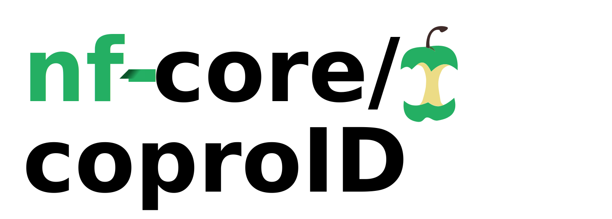

[](https://travis-ci.com/nf-core/coproid)
[](https://www.nextflow.io/)
[](http://bioconda.github.io/)
[](https://hub.docker.com/r/nfcore/coproid)
[](https://coproid.readthedocs.io/en/latest/?badge=latest) 
[](https://doi.org/10.5281/zenodo.2653756)




## Introduction

**CoproID** helps you to identify the _"true maker"_ of Illumina sequenced Coprolites/Paleofaeces by checking the microbiome composition and the endogenous DNA.

The pipeline is built using [Nextflow](https://www.nextflow.io), a workflow tool to run tasks across multiple compute infrastructures in a very portable manner. It comes with docker containers making installation trivial and results highly reproducible.

## Quick Start

1. Install [`nextflow`](https://nf-co.re/usage/installation)

2. Install one of [`docker`](https://docs.docker.com/engine/installation/), [`singularity`](https://www.sylabs.io/guides/3.0/user-guide/) or [`conda`](https://conda.io/miniconda.html)

3. Download the EAGER pipeline

```bash
nextflow pull nf-core/coproid
```

4. Test the pipeline using the provided test data

```bash
nextflow run nf-core/coproid -profile <docker/singularity/conda>,test
```

5. Run with it with you own data

nextflow run nf-core/coproid --reads '*_R{1,2}.fastq.gz' --krakendb 'path/to/minikraken_db' -profile docker

NB. You can see an overview of the run in the MultiQC report located at `<OUTPUT_DIR>/MultiQC/multiqc_report.html`

Modifications to the default pipeline are easily made using various options
as described in the documentation.

## Documentation

The nf-core/coproid pipeline comes with documentation about the pipeline, found in the `docs/` directory and at the following address: [coproid.readthedocs.io](https://coproid.readthedocs.io)

1.  [Installation](https://nf-co.re/usage/installation)
2.  Pipeline configuration
    -   [Local installation](https://nf-co.re/usage/local_installation)
    -   [Adding your own system config](https://nf-co.re/usage/adding_own_config)
    -   [Reference genomes](https://nf-co.re/usage/reference_genomes)
3.  [Running the pipeline](docs/usage.md)
4.  [Output and how to interpret the results](docs/output.md)
5.  [Troubleshooting](https://nf-co.re/usage/troubleshooting)

## Credits

nf-core/coproid was written by [Maxime Borry](https://github.com/maxibor).

## Contributors

[James A. Fellows-Yates](https://github.com/jfy133)

## Tool references

- **AdapterRemoval v2** Schubert, M., Lindgreen, S., & Orlando, L. (2016). AdapterRemoval v2: rapid adapter trimming, identification, and read merging. BMC Research Notes, 9, 88. [https://doi.org/10.1186/s13104-016-1900-2](https://doi.org/10.1186/s13104-016-1900-2)
- **FastQC** [https://www.bioinformatics.babraham.ac.uk/projects/fastqc/](https://www.bioinformatics.babraham.ac.uk/projects/fastqc/)
- **Bowtie2** Langmead, B., & Salzberg, S. L. (2012). Fast gapped-read alignment with Bowtie 2. Nature methods, 9(4), 357. [https://dx.doi.org/10.1038%2Fnmeth.1923](https://dx.doi.org/10.1038%2Fnmeth.1923)
- **Samtools** Li, H., Handsaker, B., Wysoker, A., Fennell, T., Ruan, J., Homer, N., … 1000 Genome Project Data Processing Subgroup. (2009). The Sequence Alignment/Map format and SAMtools. Bioinformatics , 25(16), 2078–2079. [https://doi.org/10.1093/bioinformatics/btp352](https://doi.org/10.1093/bioinformatics/btp352)
- **Kraken2** Wood, D. E., Lu, J., & Langmead, B. (2019). Improved metagenomic analysis with Kraken 2. BioRxiv, 762302. [https://doi.org/10.1101/762302](https://doi.org/10.1101/762302)
- **PMDTools** Skoglund, P., Northoff, B. H., Shunkov, M. V., Derevianko, A. P., Pääbo, S., Krause, J., & Jakobsson, M. (2014). Separating endogenous ancient DNA from modern day contamination in a Siberian Neandertal. Proceedings of the National Academy of Sciences of the United States of America, 111(6), 2229–2234. [https://doi.org/10.1073/pnas.1318934111](https://doi.org/10.1073/pnas.1318934111)
- **DamageProfiler** Judith Neukamm (Unpublished)
- **Sourcepredict** Borry, M. (2019). Sourcepredict: Prediction of metagenomic sample sources using dimension reduction followed by machine learning classification. The Journal of Open Source Software. [https://doi.org/10.21105/joss.01540](https://doi.org/10.21105/joss.01540)
- **MultiQC** Ewels, P., Magnusson, M., Lundin, S., & Käller, M. (2016). MultiQC: summarize analysis results for multiple tools and samples in a single report. Bioinformatics , 32(19), 3047–3048. [https://doi.org/10.1093/bioinformatics/btw354](https://doi.org/10.1093/bioinformatics/btw354)