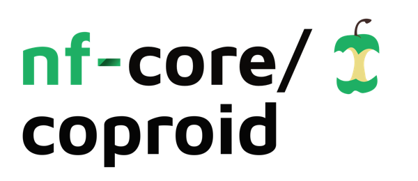

<h1>
  <picture>
    <source media="(prefers-color-scheme: dark)" srcset="docs/images/nf-core-coproid_logo_dark.png">
    
  </picture>
</h1>

[](https://github.com/nf-core/coproid/actions/workflows/ci.yml)
[](https://github.com/nf-core/coproid/actions/workflows/linting.yml)[](https://nf-co.re/coproid/results)[](https://doi.org/10.5281/zenodo.XXXXXXX)
[](https://www.nf-test.com)

[](https://www.nextflow.io/)
[](https://docs.conda.io/en/latest/)
[](https://www.docker.com/)
[](https://sylabs.io/docs/)
[](https://cloud.seqera.io/launch?pipeline=https://github.com/nf-core/coproid)

[](https://nfcore.slack.com/channels/coproid)[](https://twitter.com/nf_core)[](https://mstdn.science/@nf_core)[](https://www.youtube.com/c/nf-core)

## Introduction

**nf-core/coproid** is a bioinformatics pipeline that helps you identify the "true maker" of Illumina sequenced (Paleo)faeces by checking the microbiome composition and the endogenous host DNA.

It combines the analysis of putative host (ancient) DNA with a machine learning prediction of the faeces source based on microbiome taxonomic composition:

(A) First coproID performs comparative mapping of all reads agains two (or three) target genomes (genome1, genome2, and potentially genome3) and computes a host-DNA species ratio (NormalisedProportion).
(B) Then coproID performs metagenomic taxonomic profiling, and compares the obtained profiles to modern reference samples of the target species metagenomes. Using machine learning, coproID then estimates the host source from the metagenomic taxonomic composition (SourcepredictProportion).

Finally, coproID combines A and B proportions to predict the likely host of the metagenomic sample.

**Wokflow overview**

1. Read QC ([`FastQC`](https://www.bioinformatics.babraham.ac.uk/projects/fastqc/))
2. Present QC for raw reads ([`MultiQC`](http://multiqc.info/))
3. Fastp to remove adapters and low-complexity reads ([`fastp`](https://doi.org/10.1002/imt2.107))
4. Mapping or reads to multiple reference genomes ([`Bowtie2`](https://bowtie-bio.sourceforge.net/bowtie2))
5. Lowest Common Ancestor analysis to retain only genome specific reads ([`sam2lca`](github.com/maxibor/sam2lca))
6. Taxonomic profiling of unmapped reads ([`kraken2`](https://ccb.jhu.edu/software/kraken2/))
7. Source predicting based on taxonic profiles ([`sourcepredict`](https://sourcepredict.readthedocs.io/))
8. Combining host and microbial predictions to calculate overall proportions.

The coproID pipeline is built using Nextflow, a workflow tool to run tasks across multiple compute infrastructures in a very portable manner. It comes with docker containers making installation trivial and results highly reproducible. The Nextflow DSL2 implementation of this pipeline uses one container per process which makes it much easier to maintain and update software dependencies. Where possible, these processes have been submitted to and installed from nf-core/modules in order to make them available to all nf-core pipelines, and to everyone within the Nextflow community!

## Usage

> [!NOTE]
> If you are new to Nextflow and nf-core, please refer to [this page](https://nf-co.re/docs/usage/installation) on how to set-up Nextflow. Make sure to [test your setup](https://nf-co.re/docs/usage/introduction#how-to-run-a-pipeline) with `-profile test` before running the workflow on actual data.

Pipeline usage
First, prepare a samplesheet with your input data that looks as follows:

`samplesheet.csv`:

```csv title="samplesheet.csv"
sample,fastq_1,fastq_2
PAIRED_END,PAIRED_END_S1_L002_R1_001.fastq.gz,PAIRED_END_S1_L002_R2_001.fastq.gz
SINGLE_END,SINGLE_END_S4_L003_R1_001.fastq.gz,
```

Each row represents a fastq file (single-end) or a pair of fastq files (paired end).

Second, prepare a genomesheet with your input genome references that looks as follows:

`genomesheet.csv`:

```csv title="genomesheet.csv"
genome_name,taxid,genome_size,igenome,fasta,index
Escherichia_coli,562,5000000,,https://github.com/nf-core/test-datasets/raw/coproid/genomes/ecoli/genome.fa,
Bacillus_subtilis,1423,4200000,,https://github.com/nf-core/test-datasets/raw/coproid/genomes/bsubtilis/genome.fa,
```

Before running the pipeline, you need to download a kraken2 database, and supply this to the pipeline using --kraken2_db
The kraken2 database can be a directory or \*.tar.gz

You also need to create/download the reference files for sourcepredict. These include the source anf label files, for more information see [`sourcepredict`](https://sourcepredict.readthedocs.io/)

Now, you can run the pipeline using:

```bash
nextflow run nf-core/coproid \
   -profile <docker/singularity/.../institute> \
   --input samplesheet.csv \
   --genome_sheet genomesheet.csv \
   --kraken2_db 'PATH/TO/KRAKENDB' \
   --sp_sources 'PATH/TO/SOURCEPREDICT/SOURCES/FILE' \
   --sp_labels 'PATH/TO/SOURCEPREDICT/LABELS/FILE' \
   --outdir <OUTDIR>
```

> [!WARNING]
> Please provide pipeline parameters via the CLI or Nextflow `-params-file` option. Custom config files including those provided by the `-c` Nextflow option can be used to provide any configuration _**except for parameters**_;
> see [docs](https://nf-co.re/usage/configuration#custom-configuration-files).

For more details and further functionality, please refer to the [usage documentation](https://nf-co.re/coproid/usage) and the [parameter documentation](https://nf-co.re/coproid/parameters).

## Pipeline output

To see the results of an example test run with a full size dataset refer to the [results](https://nf-co.re/coproid/results) tab on the nf-core website pipeline page.
For more details about the output files and reports, please refer to the
[output documentation](https://nf-co.re/coproid/output).

## Credits

nf-core/coproid was originally written by Maxime Borry & Meriam Van Os.

We thank the following people for their extensive assistance in the development of this pipeline:

<!-- TODO nf-core: If applicable, make list of people who have also contributed -->

## Contributions and Support

If you would like to contribute to this pipeline, please see the [contributing guidelines](.github/CONTRIBUTING.md).

For further information or help, don't hesitate to get in touch on the [Slack `#coproid` channel](https://nfcore.slack.com/channels/coproid) (you can join with [this invite](https://nf-co.re/join/slack)).

## Citations

If you use nf-core/coproid for your analysis, please cite it using the following doi: [10.5281/zenodo.7292889](https://doi.org/10.5281/zenodo.7292889)

<!-- TODO nf-core: Add bibliography of tools and data used in your pipeline -->

An extensive list of references for the tools used by the pipeline can be found in the [`CITATIONS.md`](CITATIONS.md) file.

You can cite the `nf-core` publication as follows:

> **The nf-core framework for community-curated bioinformatics pipelines.**
>
> Philip Ewels, Alexander Peltzer, Sven Fillinger, Harshil Patel, Johannes Alneberg, Andreas Wilm, Maxime Ulysse Garcia, Paolo Di Tommaso & Sven Nahnsen.
>
> _Nat Biotechnol._ 2020 Feb 13. doi: [10.1038/s41587-020-0439-x](https://dx.doi.org/10.1038/s41587-020-0439-x).
