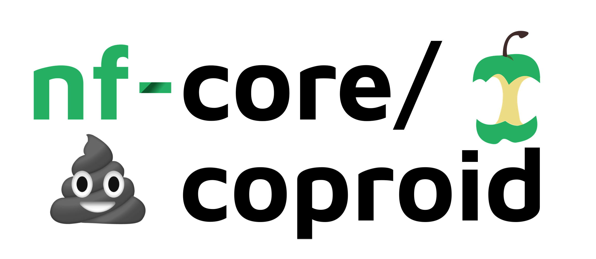

# 

## A fully reproducible pipeline for COPROlite and paleofeces host IDentification

[](https://github.com/nf-core/coproid/actions)
[](https://github.com/nf-core/coproid/actions)
[](https://www.nextflow.io/)
[](http://bioconda.github.io/)
[](https://hub.docker.com/r/nfcore/coproid)

[](https://coproid.readthedocs.io/en/latest/?badge=latest)
[](https://doi.org/10.5281/zenodo.2653756)
[](https://nfcore.slack.com/channels/coproid)
[](https://peerj.com/articles/9001)

**CoproID** helps you to identify the _"true maker"_ of Illumina sequenced Coprolites/Paleofaeces by checking the microbiome composition and the endogenous DNA.

It combines the analysis of putative host ancient DNA with a machine learning prediction of the feces source based on microbiome taxonomic composition:

- (**A**) First coproID performs a comparative mapping of all reads agains two (or three) target genomes (genome1, genome2, and eventually genome3) and computes a host-DNA species ratio (_NormalizedRatio_)
- (**B**) Then coproID performs a metagenomic taxonomic profiling, and compares the obtained profiles to modern reference samples of the target species metagenomes. Using [machine learning](https://joss.theoj.org/papers/10.21105/joss.01540), coproID then estimates the host source from the metagenomic taxonomic composition (_prop_microbiome_).
- Finally, coproID combines **A** and **B** to predict the likely host of the metagenomic sample.

The coproID pipeline is built using [Nextflow](https://www.nextflow.io), a workflow tool to run tasks across multiple compute infrastructures in a very portable manner. It comes with docker containers making installation trivial and results highly reproducible.

A detailed description of coproID can be found in the [article published in PeerJ](https://peerj.com/articles/9001).

## Quick Start

i. Install [`nextflow`](https://nf-co.re/usage/installation)

ii. Install either [`Docker`](https://docs.docker.com/engine/installation/) or [`Singularity`](https://www.sylabs.io/guides/3.0/user-guide/) for full pipeline reproducibility (please only use [`Conda`](https://conda.io/miniconda.html) as a last resort; see [docs](https://nf-co.re/usage/configuration#basic-configuration-profiles))

iii. Download the pipeline and test it on a minimal dataset with a single command

```bash
nextflow run nf-core/coproid -profile test,<docker/singularity/conda/institute>
```

> Please check [nf-core/configs](https://github.com/nf-core/configs#documentation) to see if a custom config file to run nf-core pipelines already exists for your Institute. If so, you can simply use `-profile institute` in your command. This will enable either `docker` or `singularity` and set the appropriate execution settings for your local compute environment.

iv. Start running your own analysis!

```bash
nextflow run maxibor/coproid --genome1 'GRCh37' --genome2 'CanFam3.1' --name1 'Homo_sapiens' --name2 'Canis_familiaris' --reads '*_R{1,2}.fastq.gz' --krakendb 'path/to/minikraken_db' -profile docker
```

This command runs coproID to estimate whether the source of test samples (`--reads '*_R{1,2}.fastq.gz'`) are coming from a human (`--genome1 'GRCh37' -name1 'Homo_sapiens'`) or a dog (`--genome2 'CanFam3.1' --name2 'Canis_familiaris'`), and specifies the path to the minikraken database (`--krakendb 'path/to/minikraken_db'`).

> NB: The example above assumes access to [iGenomes](https://nf-co.re/usage/reference_genomes).

See [usage docs](docs/usage.md) for all of the available options when running the pipeline.

## Documentation

The nf-core/coproid pipeline comes with documentation about the pipeline, found in the `docs/` directory:

The nf-core/coproid pipeline comes with documentation about the pipeline, found in the `docs/` directory and at the following address: [coproid.readthedocs.io](https://coproid.readthedocs.io)

1. [Installation](https://nf-co.re/usage/installation)
2. Pipeline configuration
    - [Local installation](https://nf-co.re/usage/local_installation)
    - [Adding your own system config](https://nf-co.re/usage/adding_own_config)
    - [Reference genomes](https://nf-co.re/usage/reference_genomes)
3. [Running the pipeline](docs/usage.md)
4. [Output and how to interpret the results](docs/output.md)
5. [Troubleshooting](https://nf-co.re/usage/troubleshooting)

## Credits

nf-core/coproid was written by [Maxime Borry](https://github.com/maxibor).

## Contributions and Support

If you would like to contribute to this pipeline, please see the [contributing guidelines](.github/CONTRIBUTING.md).

For further information or help, don't hesitate to get in touch on [Slack](https://nfcore.slack.com/channels/coproid) (you can join with [this invite](https://nf-co.re/join/slack)).

## Citing

coproID has been published in [peerJ](https://peerj.com/articles/9001). The bibtex citation is available below:

```bibtex
@article{borry_coproid_2020,
 title = {{CoproID} predicts the source of coprolites and paleofeces using microbiome composition and host {DNA} content},
 volume = {8},
 issn = {2167-8359},
 url = {https://peerj.com/articles/9001},
 doi = {10.7717/peerj.9001},
 language = {en},
 urldate = {2020-04-20},
 journal = {PeerJ},
 author = {Borry, Maxime and Cordova, Bryan and Perri, Angela and Wibowo, Marsha and Honap, Tanvi Prasad and Ko, Jada and Yu, Jie and Britton, Kate and Girdland-Flink, Linus and Power, Robert C. and Stuijts, Ingelise and Salazar-García, Domingo C. and Hofman, Courtney and Hagan, Richard and Kagoné, Thérèse Samdapawindé and Meda, Nicolas and Carabin, Helene and Jacobson, David and Reinhard, Karl and Lewis, Cecil and Kostic, Aleksandar and Jeong, Choongwon and Herbig, Alexander and Hübner, Alexander and Warinner, Christina},
 month = apr,
 year = {2020},
 note = {Publisher: PeerJ Inc.},
 pages = {e9001}
}
```

## Contributors

[James A. Fellows Yates](https://github.com/jfy133)

## Tool references

- **AdapterRemoval v2** Schubert, M., Lindgreen, S., & Orlando, L. (2016). AdapterRemoval v2: rapid adapter trimming, identification, and read merging. BMC Research Notes, 9, 88. [https://doi.org/10.1186/s13104-016-1900-2](https://doi.org/10.1186/s13104-016-1900-2)
- **FastQC** [https://www.bioinformatics.babraham.ac.uk/projects/fastqc/](https://www.bioinformatics.babraham.ac.uk/projects/fastqc/)
- **Bowtie2** Langmead, B., & Salzberg, S. L. (2012). Fast gapped-read alignment with Bowtie 2. Nature methods, 9(4), 357. [https://dx.doi.org/10.1038%2Fnmeth.1923](https://dx.doi.org/10.1038%2Fnmeth.1923)
- **Samtools** Li, H., Handsaker, B., Wysoker, A., Fennell, T., Ruan, J., Homer, N., … 1000 Genome Project Data Processing Subgroup. (2009). The Sequence Alignment/Map format and SAMtools. Bioinformatics , 25(16), 2078–2079. [https://doi.org/10.1093/bioinformatics/btp352](https://doi.org/10.1093/bioinformatics/btp352)
- **Kraken2** Wood, D. E., Lu, J., & Langmead, B. (2019). Improved metagenomic analysis with Kraken 2. BioRxiv, 762302. [https://doi.org/10.1101/762302](https://doi.org/10.1101/762302)
- **PMDTools** Skoglund, P., Northoff, B. H., Shunkov, M. V., Derevianko, A. P., Pääbo, S., Krause, J., & Jakobsson, M. (2014). Separating endogenous ancient DNA from modern day contamination in a Siberian Neandertal. Proceedings of the National Academy of Sciences of the United States of America, 111(6), 2229–2234. [https://doi.org/10.1073/pnas.1318934111](https://doi.org/10.1073/pnas.1318934111)
- **DamageProfiler** Judith Neukamm (Unpublished): [10.5281/zenodo.1064062](https://doi.org/10.5281/zenodo.1064062)
- **Sourcepredict** Borry, M. (2019). Sourcepredict: Prediction of metagenomic sample sources using dimension reduction followed by machine learning classification. The Journal of Open Source Software. [https://doi.org/10.21105/joss.01540](https://doi.org/10.21105/joss.01540)
- **MultiQC** Ewels, P., Magnusson, M., Lundin, S., & Käller, M. (2016). MultiQC: summarize analysis results for multiple tools and samples in a single report. Bioinformatics , 32(19), 3047–3048. [https://doi.org/10.1093/bioinformatics/btw354](https://doi.org/10.1093/bioinformatics/btw354)
