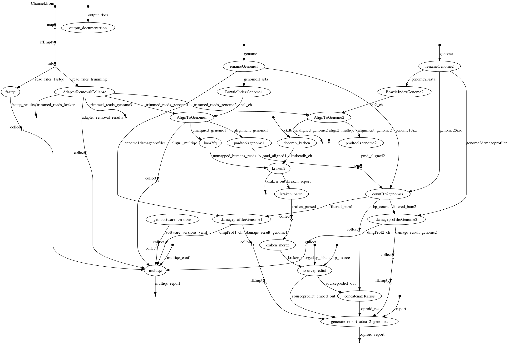

# Introduction


**coproID** (**CO**prolite **ID**entification) is a tool developed at the
[Max Planck insitute for the Science of Human History](http://www.shh.mpg.de/en)
by [Maxime Borry](https://github.com/maxibor)

The purpose of **coproID** is to help identify the host of given sequence microbiome when there is a doubt between species.

**coproID** is a pipeline developed using [Nextflow](https://www.nextflow.io/) and made available through [nf-core](https://github.com/nf-core)

Even though it was developed with coprolite host identification in mind, it can be applied to any microbiome, provided they contain host DNA.

## Quick start

Example:

```bash
nextflow run maxibor/coproid --genome1 'GRCh37' --genome2 'CanFam3.1' --name1 'Homo_sapiens' --name2 'Canis_familiaris' --reads '*_R{1,2}.fastq.gz'
```

## coproID example workFlow



## How to cite coproID

coproID has been published in [peerJ](https://peerj.com/articles/9001), the bibtex citation is available below:

```bibtex
@article{borry_coproid_2020,
    title = {{CoproID} predicts the source of coprolites and paleofeces using microbiome composition and host {DNA} content},
    volume = {8},
    issn = {2167-8359},
    url = {https://peerj.com/articles/9001},
    doi = {10.7717/peerj.9001},
    language = {en},
    urldate = {2020-04-20},
    journal = {PeerJ},
    author = {Borry, Maxime and Cordova, Bryan and Perri, Angela and Wibowo, Marsha and Honap, Tanvi Prasad and Ko, Jada and Yu, Jie and Britton, Kate and Girdland-Flink, Linus and Power, Robert C. and Stuijts, Ingelise and Salazar-García, Domingo C. and Hofman, Courtney and Hagan, Richard and Kagoné, Thérèse Samdapawindé and Meda, Nicolas and Carabin, Helene and Jacobson, David and Reinhard, Karl and Lewis, Cecil and Kostic, Aleksandar and Jeong, Choongwon and Herbig, Alexander and Hübner, Alexander and Warinner, Christina},
    month = apr,
    year = {2020},
    note = {Publisher: PeerJ Inc.},
    pages = {e9001}
}
```
