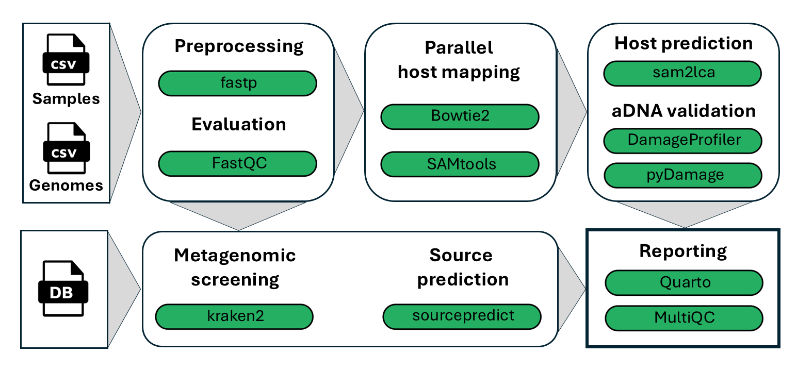

# Summary

Coming

# Statement of need

(Palaeo)faeces are valuable resources to study the depositor's DNA, diet, microbiome, health and more (sources). However, it is often difficult to distinguish between the depositor based on the faeces morphology alone. For example, humans and dogs often overlap in their diets, and produce similar faeces in size and shape. In 2020, the pipeline nf-core/coproID v1.0 was published, which uses both host and microbial DNA to predict the depositor of faecal samples. The microbiome can be a crucial part for a host prediction, as the host DNA content in faeces can be very low in certain species (sources). Since its first release, new tools have become available that can improve the accuracy and usability of nf-core/coproID. Here we present the newest version of the pipeline, nf-core/coproID 2.XXX, rewritten in the newest Nextflow DLS2 language and with newly incorporated tools.

# Materials and Methods

nf-core/coproID is a bioinformatics pipeline that helps identify the "true depositor" of DNA whole genome shotgun sequenced (palaeo)faeces by analysing the microbiome composition together with the endogenous host DNA.

It combines the analysis of the putative host (ancient) DNA with a machine learning prediction of the faeces source, based on microbiome taxonomic composition:

1. First, coproID performs parallel mapping of all reads agains two (or more) target genomes (genome1, genome2, ..., genomeX) using bowtie2 [Langmead:2018], and computes a host-DNA species ratio (NormalisedProportion) using sam2lca [Borry:2022].
1. Next, coproID performs metagenomic taxonomic profiling with kraken2 [Wood:2019], and compares the obtained profiles to user supplied modern reference samples of the target species metagenomes. Using machine learning, sourcepredict [Borry:2019] then estimates the host source from the metagenomic taxonomic composition (SourcepredictProportion).
1. Finally, coproID combines the A and B proportions to predict the likely host of the metagenomic sample.

## Workflow

The newest version of coproID, v2.XXX, was entirely rewritten in the newest DSL2 language of Nextflow to enhance modularity, reusability, and scalability [DITommaso:2017]. Additionally, various modifications were made to the workflow to improve accuracy and reporting.

Figure 1 describes the newest workflow:

1. Quality check of the input fastq reads with FastQC [Andrews:2010].
1. Fastp is used to remove adapters and low-complexity reads [Chen:2018].
1. Mapping of pre-processed reads to multiple reference genomes with Bowtie2 [Langmead:2018].
1. Lowest Common Ancestor analysis with sam2lca [Borry:2022] to retain only genome specific reads, i.e. reads that align equally well to multiple references are identified as belonging to a Lower Common Ancestor and removed from the read counts. The sam2lca read counts are normalised by the size of the genome. First, a normalisation factor is calculated per reference, or source species (sp):

$$
NormalisationFactor_{sp}  = AverageReferenceLength / ReferenceLength_{sp}
$$

The normalised read counts are then calculated by:

$$
NormalisedReads_{sp}  = sam2lcaReads_{sp} * NormalisationFactor_{sp}
$$

1. Taxonomic profiling is performed on pre-processed reads with kraken2 [Wood:2019], and by using a customer supplied database. Kraken2 reports are parsed and merged into one table for all samples.
1. Sourcepredict [Borry:2019] is then used to predict the source proportions, based on the kraken2 taxonomic profiles, and by using customer supplied reference sources (which should have been created with the same reference database).
1. Both the host DNA (NormalisedReads) and sourcepredict proportion are used to predict the most likely depositor of the (palaeo)faeces. The probability of each reference species is calculated by:

$$
Probability_{sp}  = NormalisedSam2lcaProportion_{sp} * SourcepredictProportion_{sp}
$$

1. MultiQC [Ewels:2016] aggregates results of several individual nf-core modules.
1. Quartonotebook [Allaire:2024] creates a report with an overview of all sample results (incl. tables and figures). This includes the (normalised) sam2lca results and calculations, the sourcepredict results, and DNA damage patterns analysed by pyDamage [Borry:2021] and damageprofiler [Neukamm:2021].

## Output

The results are located in a nested folder architecture. Fourteen subfolders are created within the customer identified output folder:
- bowtie2
- create
- damageprofiler
- fastp
- fastqc
- kraken
- kraken2
- multiqc
- pipeline_info
- pydamage
- quartonotebook
- sam2lca
- samtools
- sourcepredict

These subfolders contain the main outputs from the concerned analyses. When the kraken2 database is supplied as a archive file (*.tar.gz), and/or the sourcepredict supplied taxa_sqlite file (ending in .xz), the additional folder
- untar
- xz
are created with the decompressed files/folders.

# Discussion and conclusions

Here we present a new version of the nf-core/coproID pipeline, designed to identify the true depositor of (palaeo)faeces. Written in Nextflow DSL2, and adhering the latest nf-core standards and guidelines, coproID 2.XXX is more modular, reusable, and scalable. It includes several new features, including fastp for faster pre-processing of the sequencing reads, sam2lca to improve and generalize host DNA prediction, pyDamage to discriminate between ancient and modern DNA, and the automated creation of an overall Quarto notebook html report. The modular design of nf-core/coproID 2.XXX by using Nextflow's most recent DSL2 and nf-core modules, also makes it easier for users to customise the pipeline, for example by adding more modules and workflows.

# Figures

# References
