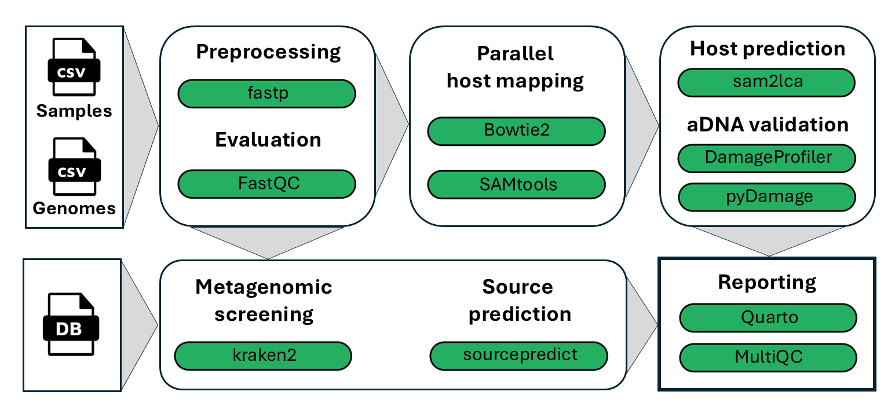

# Summary

With the advancement of Next Generation Sequencing technologies, (palaeo)faeces have become a unique and valuable source in the fields of archaeology [@Battillo:2019], microbiome studies [@Rifkin:2020; @Wibowo:2021], species ecology and conservation [@Ang:2020; @Taylor:2022], and even shows promise in forensic investigations [@Quaak:2017; @Quaak:2018]. To use faecal samples for such studies, often the first question is "who deposited the faeces?", before doing additional analyses. The nf-core/coproID pipeline helps to answer this question by taking raw sequencing data and predicting the depositor's species.

The raw sequencing data is first pre-processed to trim adapters and remove low quality and low complexity reads with fastp [@Chen:2018]. Bowtie2 [@Langmead:2018] is then used to align the reads to multiple user-specified reference genomes of potential depositor (host) species. Next, these reads are processed with sam2lca [@Borry:2022] to retain only reads specific to one of the references, and normalised according to the size of the genome. Furthermore, a taxonomic profile is created with kraken2 [@Wood:2019], and compared to a user supplied database of potential sources using sourcepredict to estimate the percentages of contributing sources [@Borry:2019]. Both the normalised host DNA and the sourcepredict results are used to predict the most likely depositor of the faeces. The pipeline also incorporates ancient DNA damage estimates using pyDamage [@Borry:2021] and damageprofiler [@Neukamm:2021] for authenticating the ancient nature of the host DNA, when working with palaeofaeces. All results are collated into a Quarto notebook html report for an easy overview of all the results. 

# Statement of need

As mentioned above, (palaeo)faeces are valuable resources to study the depositor's DNA, diet, microbiome, health and more. However, it is often difficult to identify the depositor based on the faeces morphology alone. For example, humans and dogs often overlap in their diets, and produce similarly sized faeces. In 2020, the pipeline nf-core/coproID v1.0 was published [@Borry:2020], which uses both host and microbial DNA to predict the depositor of faecal samples. The microbiome can be a crucial part for a host prediction, as the host DNA content in faeces can be very low in certain species and/or individuals [@Ang:2020; @Perry:2010], including humans and modern dogs [@Borry:2020]. Since its first release, new tools have become available that can improve the accuracy and usability of nf-core/coproID. Here we present the newest version of the pipeline, nf-core/coproID v2.0.0, rewritten in the newest Nextflow DLS2 language to enhance modularity, reusability, and scalability [@DITommaso:2017], and with newly added features to improve accuracy and reporting.

# Materials and Methods

nf-core/coproID combines the analysis of the putative host (ancient) DNA with a machine learning prediction of the faeces source, based on microbiome taxonomic composition:

A. First, nf-core/coproID performs parallel mapping of all reads agains two (or more) target genomes (genome1, genome2, ..., genomeX) using bowtie2 [@Langmead:2018], and computes a host-DNA species ratio (NormalisedProportion) using sam2lca [@Borry:2022].
B. Next, nf-core/coproID performs metagenomic taxonomic profiling with kraken2 [@Wood:2019], and compares the obtained profiles to user supplied modern reference samples of the target species metagenomes. Using machine learning, sourcepredict [@Borry:2019] then estimates the host source from the metagenomic taxonomic composition (SourcepredictProportion).
C. Finally, nf-core/coproID combines the A and B proportions to predict the likely host of the metagenomic sample.

## Workflow

Figure 1 describes the newest workflow:

1. Quality check of the input fastq reads with FastQC [@Andrews:2010].
2. Removal of adapters and low-complexity reads with fastp [@Chen:2018].
3. Mapping of adapter trimmed reads to multiple reference genomes with Bowtie2 [@Langmead:2018].
4. Lowest Common Ancestor analysis with sam2lca [@Borry:2022] to retain only genome specific reads, i.e. reads that align equally well to multiple references are removed from the read counts. The sam2lca read counts are normalised by the size of the genome as follows. First, a normalisation factor is calculated per reference, or source species (sp):

$$
Average Reference Length = ∑_{sp} Reference Length_{sp} / Number of References
$$

$$
Normalisation Factor_{sp}  = Average Reference Length / Reference Length_{sp}
$$

Then, normalised read counts are calculated by:

$$
Normalised Reads_{sp}  = sam2lca Reads_{sp} * Normalisation Factor_{sp}
$$

5. Taxonomic profiling is performed on adapter trimmed reads with kraken2 [@Wood:2019], and by using a custom supplied database. Kraken2 reports are parsed and merged into one table for all samples.
6. Sourcepredict [@Borry:2019] is then used to predict the source proportions, based on the kraken2 taxonomic profiles, and by using user supplied reference sources (which should have been created with the same reference database).
7. Both the host DNA (NormalisedReads) and sourcepredict proportion are used to predict the most likely depositor of the (palaeo)faeces. The probability of each reference species is calculated by:

$$
Probability_{sp}  = NormalisedSam2lcaProportion_{sp} * SourcepredictProportion_{sp}
$$

8. Ancient DNA damage patterns are estimated using pyDamage [@Borry:2021] and damageprofiler [@Neukamm:2021] to authenticate the ancient nature of the DNA when working on palaeofaecal samples. 
9. MultiQC [@Ewels:2016] aggregates results of several individual nf-core modules.
10. Quarto notebook [@Allaire:2024] creates a report with an overview of all sample results (incl. tables and figures).

## Output

The results are located in a nested folder architecture. Fourteen subfolders are created within the user identified output folder:
- bowtie2
- create
- damageprofiler
- fastp
- fastqc
- kraken
- kraken2
- multiqc
- pipeline_info
- pydamage
- quartonotebook
- sam2lca
- samtools
- sourcepredict

# Discussion and conclusions

We present a new version of the nf-core/coproID pipeline, v2.0.0, designed to identify the true depositor of (palaeo)faeces. Written in Nextflow DSL2, and adhering to the latest nf-core standards and guidelines, nf-core/coproID v2.0.0 is more modular, reusable, and scalable. It includes several new features, including fastp for faster pre-processing of the sequencing reads, sam2lca to improve and generalise host DNA prediction, pyDamage to discriminate between ancient and modern DNA, and the automated creation of a Quarto notebook html report. The modular design also makes it easier for users to customise the pipeline, for example by adding more modules and workflows.

# Funding source declaration
MO was supported by a University of Otago Doctoral Scholarship.

# Availability

The nf-core/coproID pipeline is freely available from the nf-core pipeline repository [https://nf-co.re/coproid/2.0.0/](https://nf-co.re/coproid/2.0.0/).

# Figures

# References
